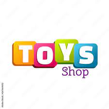
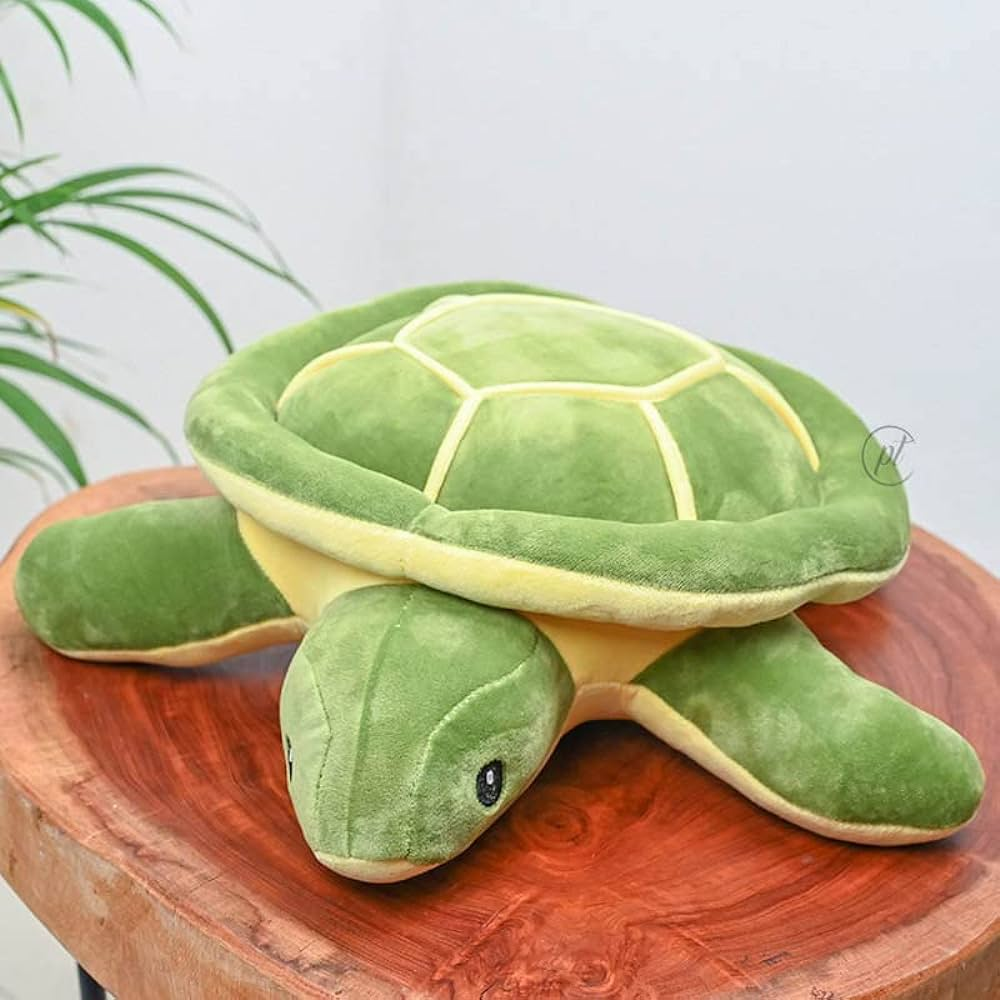
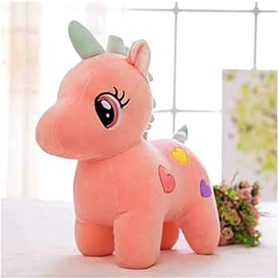
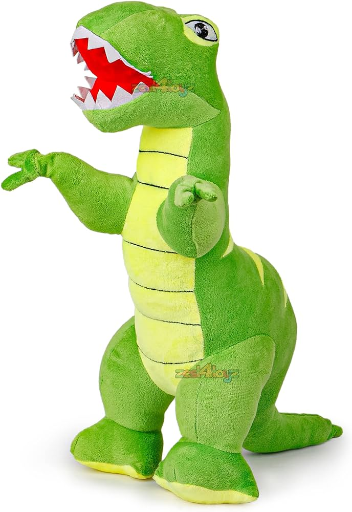
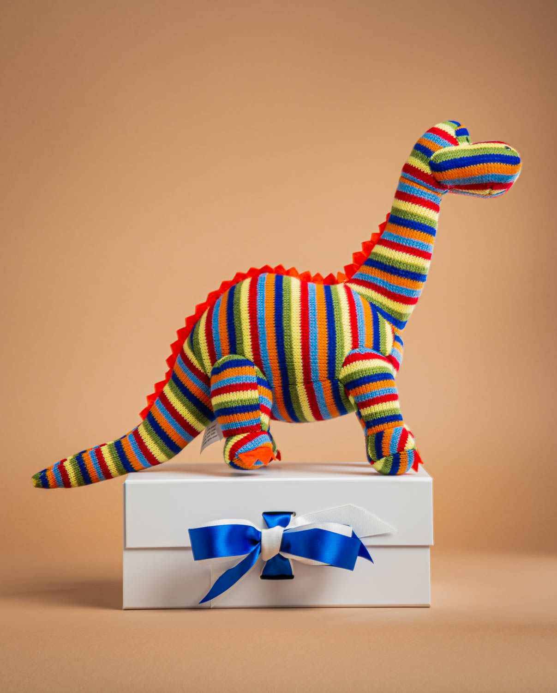
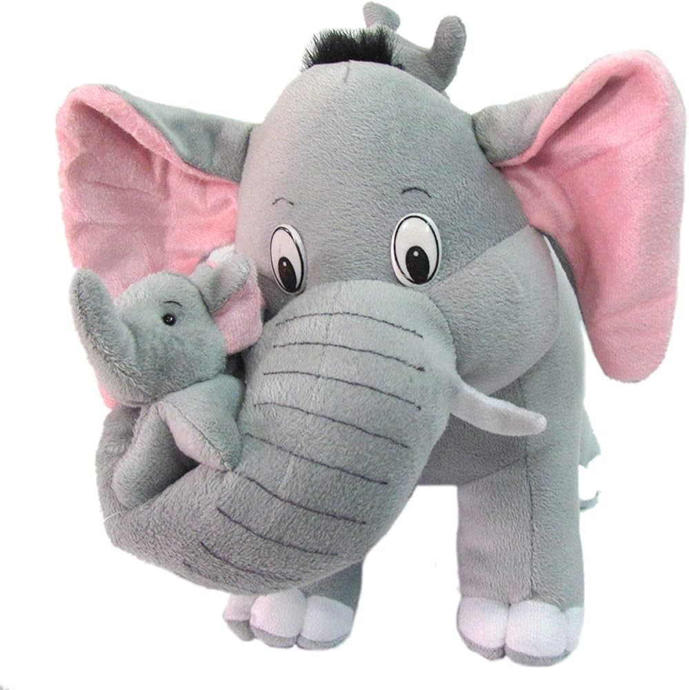

body {
    font-family: Arial, sans-serif;
    margin: 0;
    padding: 0;
}

header {
    background-color: #eed6d6;
    padding: 20px;
    text-align: center;
}

.container {
    display: flex;
    justify-content: space-around;
    flex-wrap: wrap;
    margin-top: 20px;
}

.product {
    text-align: center;
    margin-bottom: 20px;
}

.product img {
    width: 200px;
    height: 200px;
    border: 1px solid #ccc;
    border-radius: 10px;
}

button {
    background-color: #4CAF50;
    color: white;
    padding: 10px 20px;
    border: none;
    border-radius: 5px;
    cursor: pointer;
}

button:hover {
    background-color: #45a049;
}

#cart {
    position: fixed;
    top: 0;
    right: 0;
    background-color: #e0acac;
    padding: 20px;
    border-left: 1px solid #ccc;
    text-align: center;
}

#cart-items {
    list-style-type: none;
    padding: 0;
}

#cart-items li {
    margin-bottom: 10px;
}

.logo img {
    width: 100px;
    height: 100px;
}

/* Adjust header styles for positioning */
header {
    padding: 20px;
    display: flex;
    align-items: center; /* Align logo and header text vertically */
}

h1 {
    margin-left: 20px; /* Add some space between logo and header text */
}
let cart = [];

function addToCart(itemName, price) {
    cart.push({ name: itemName, price: price });
    updateCart();
}

function updateCart() {
    const cartItemsElement = document.getElementById('cart-items');
    const cartTotalElement = document.getElementById('cart-total');
    cartItemsElement.innerHTML = '';
    let total = 0;
    cart.forEach(item => {
        total += item.price;
        const li = document.createElement('li');
        li.textContent = `${item.name} - $${item.price}`;
        cartItemsElement.appendChild(li);
    });
    cartTotalElement.textContent = `$${total.toFixed(2)}`;
}

function checkout() {
    alert('Thank you for your purchase!');
    cart = [];
    updateCart();
}
<!DOCTYPE html>
<html lang="en">
<head>
    <meta charset="UTF-8">
    <meta name="viewport" content="width=device-width, initial-scale=1.0">
    <title>Soft Toy Shop</title>
    <link rel="stylesheet" href="mini2c.css">
</head>
<body>
    <header>
        
        <h1>The Panda Store</h1>
    </header>
    

        

            
            <h2>Doll</h2>
            
$19.99

            <button onclick="addToCart('Soft Toy 1', 19.99)">Add to Cart</button>
        

        

            
            <h2>Pinky Puffy</h2>
            
$24.99

            <button onclick="addToCart('Soft Toy 2', 24.99)">Add to Cart</button>
        

        

            
            <h2>Olaf</h2>
            
$23.9

            <button onclick="addToCart('Soft Toy 3', 23.9)">Add to Cart</button>
        

        

            
            <h2>Candy Teddy</h2>
            
$12.78

            <button onclick="addToCart('Soft Toy 4', 12.78)">Add to Cart</button>
        

        

            
            <h2>Shinchan</h2>
            
$19.99

            <button onclick="addToCart('Soft Toy 5', 19.99)">Add to Cart</button>
        

        

            
            <h2>Turtle</h2>
            
$29.99

            <button onclick="addToCart('Soft Toy 6', 29.99)">Add to Cart</button>
        

        

            
            <h2>Unicorn</h2>
            
$12.78

            <button onclick="addToCart('Soft Toy 7', 12.78)">Add to Cart</button>
        

        

            
            <h2>Minion</h2>
            
$10.67

            <button onclick="addToCart('Soft Toy 8', 10.67)">Add to Cart</button>
        

        

            
            <h2>Dino</h2>
            
$23.99

            <button onclick="addToCart('Soft Toy 9', 23.99)">Add to Cart</button>
        

        

            
            <h2>Rhino</h2>
            
$14.44

            <button onclick="addToCart('Soft Toy 10', 14.44)">Add to Cart</button>
        

        

            
            <h2>Elephant</h2>
            
$18.78

            <button onclick="addToCart('Soft Toy 11', 18.78)">Add to Cart</button>
        

    

    

        <h2>Shopping Cart</h2>
        <ul id="cart-items"></ul>
        
Total: $0.00

        <button onclick="checkout()">Checkout</button>
    

    
</body>
</html>
